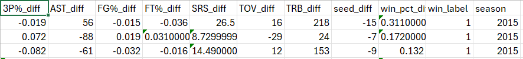
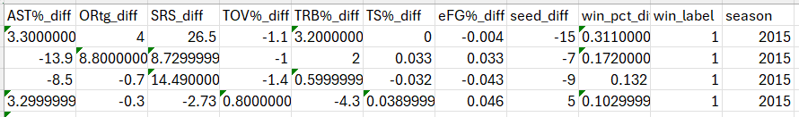
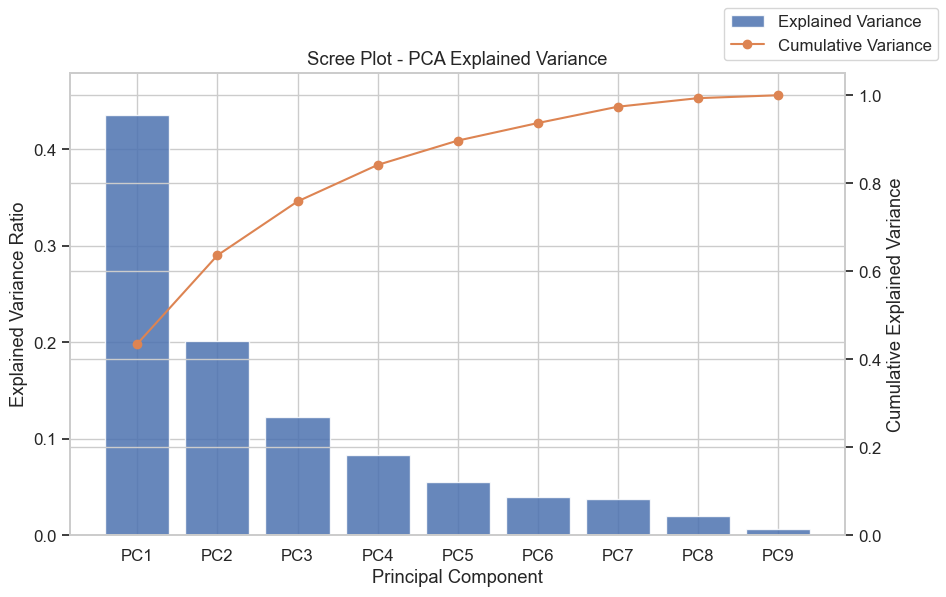
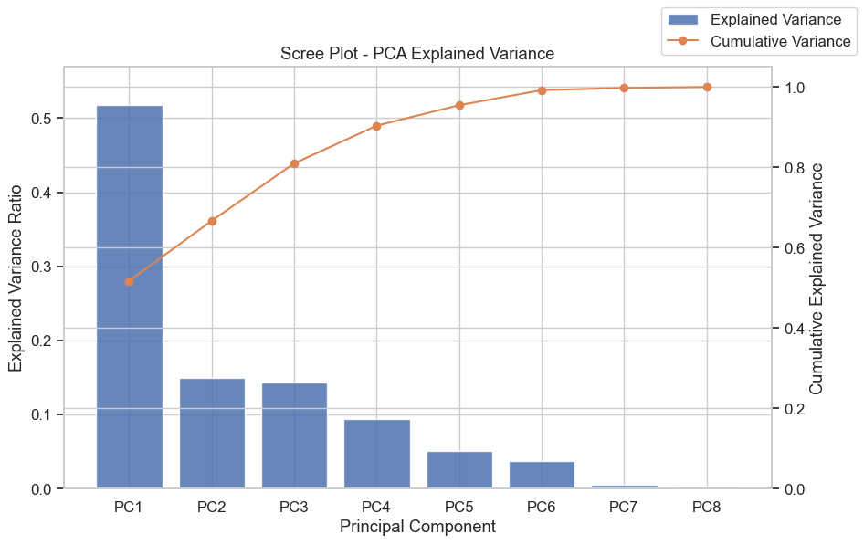
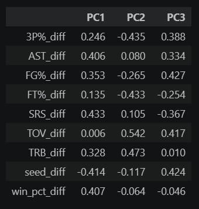

This is our demo, which will basically walk through what we have done for the creation of our data, how we created and used our models, and how we evaluated the results. The part at the end will show our model run on the 2026 MArch Madness tournament.

## Data Creation

Cleandata.ipynb is the notebook that shows how we scraped and created our dataset of the games. We got our data from sports-reference.com. Here is an example of the output of the data:

       team   G   W   L  win_pct    SRS   SOS  Conf_W  Conf_L  Home_W  ...  \
0    Albany  33  24   9    0.727  -0.34 -5.18      15       1      12  ...   
1   Arizona  38  34   4    0.895  24.33  7.41      16       2      17  ...   
2  Arkansas  36  27   9    0.750  14.07  6.79      13       5      17  ...   
3    Baylor  34  24  10    0.706  17.85  9.33      11       7      16  ...   
4   Belmont  33  22  11    0.667   0.35 -2.77      11       5      12  ...   

   FTA    FT%  ORB   TRB  AST  STL  BLK  TOV   PF  year  
0  650  0.758  334  1111  349  187   53  381  544  2015  
1  974  0.719  411  1399  528  275  131  419  681  2015  
2  819  0.724  470  1290  579  277  168  430  684  2015  
3  723  0.674  497  1333  497  263  132  434  565  2015  
4  585  0.692  307  1093  504  209   66  451  549  2015  

This was data from every team that played in the NCAA basketball tournament from 2015 to 2023. We have 30 features for each team, and the year that they played in the tournament.

To prepare our data and make it useful for running models, we created a new dataset that had the difference between the two teams for each feature. So for example, if team A had 10 wins and team B had 20 wins, then the feature "win_diff" would be -10. We also created a target variable called "result", which was 1 if team A won and 0 if team B won. This way, we could run our models on the differences between the teams and predict the probability of team A winning. We also created an advanced version of the dataset with additional feature differences.Here is a screenshot of the top of the datasets, first of the difference dataset and then of the advanced difference dataset:

We ran three models: a baseline, in which othe higher seed was always predicted to win, a logistic regression model, and a random forest model. We trained our models on the data from 2015 to 2022, and tested them on the data from 2023-2025. We evaluated our models using accuracy.

Baseline accuracy: 0.70
logistic regression accuracy: 0.7580
random forest accuracy: 0.7675

After evaluating this, we determined that the random forest model was the best, but we wanted to further refine it by using an unsupervised method. We ended up doing PCA feature engineering.

For the explained variance by principal component, we found these results:

for the advanced data, this was the explained variance:

Here is the Feature loadings for the first three principal components for the regular data:

And here it is for the advanced data:

The accuracy for the PCA Random Forest: 0.7548

Accuracy for the PCA Random Forest with advanced data: 0.7357

Overall, the PCA feature engineering did not improve our model, but it was a good exercise to see how it worked and to see the explained variance and feature loadings. We think that the random forest model without PCA is the best model for our data.

To finish, we ran our model on the 2026 tournament, giving it the starting 64 teams and having it run a tournament simulation. We ran tournament simulation and got these results:

=============== FINAL FOUR ===============
  Duke (1) vs Arizona (1) -> WINNER: Arizona (65.7%)
  Florida (1) vs Michigan (1) -> WINNER: Michigan (74.6%)
  ---

=============== NATIONAL CHAMPIONSHIP ===============
  Arizona (1) vs Michigan (1) -> WINNER: Michigan (54.3%)

==================================================
🎉 2026 NATIONAL CHAMPION PREDICTION: Michigan 🎉
==================================================

Just like in the real-life tournament, the model predicted that Michigan would win. However, it predicted Arizona to make the finals instead of UConn, and the final four teams to be the 1 seeds.